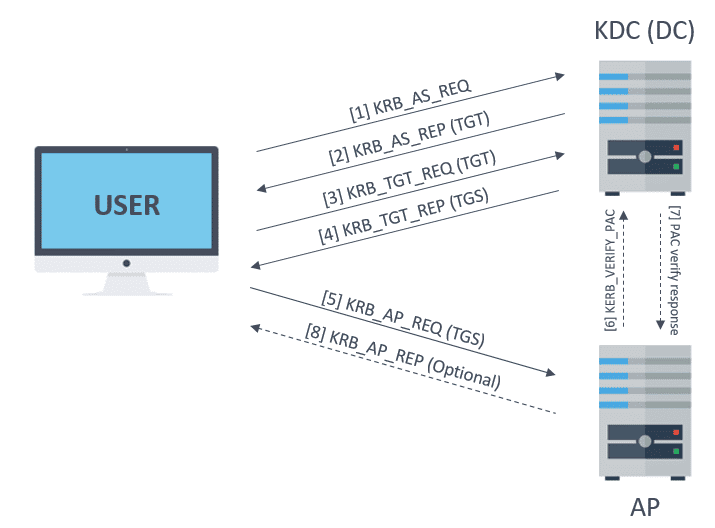

# Безопасность в сети: Введение

В современном мире цифровая безопасность — одна из самых актуальных проблем. В то время как интернет и локальные сети делают наши жизни удобнее, они также создают новые риски. С ростом количества пользователей и устройств, подключенных к сети, возрастает и количество атак, направленных на кражу личных данных, паролей и конфиденциальной информации.

Одной из ключевых задач в области безопасности является **защита данных при их передаче в сети**. Когда пользователь отправляет информацию — будь то логин и пароль, файлы или сообщения — данные могут быть перехвачены злоумышленниками, если не защищены должным образом. Рассмотрим основные угрозы, с которыми сталкиваются сети.

## Основные угрозы

### 1. Перехват данных (Man-in-the-Middle)
Это одна из самых распространённых атак, при которой злоумышленник может подслушивать или даже изменять данные, передаваемые между пользователем и сервером. Например, когда пользователь вводит пароль на веб-сайте через незащищённое соединение, этот пароль может быть захвачен и использован для несанкционированного доступа.

### 2. Фишинг
Фишинг — это способ получения конфиденциальной информации у пользователей через поддельные сайты или сообщения. Злоумышленники создают копии легитимных веб-ресурсов и заманивают пользователей вводить свои пароли, полагая, что они находятся на безопасном сайте.

### 3. Повторное использование паролей
Люди часто используют один и тот же пароль для разных сервисов. Это делает их уязвимыми, потому что при утечке одного пароля злоумышленники могут получить доступ к множеству ресурсов. Например, утечка пароля от социальной сети может привести к компрометации учетных записей в интернет-банкинге или почте.

### 4. Незащищенные протоколы
Многие старые протоколы передачи данных, такие как FTP и HTTP, не обеспечивают достаточной защиты, так как передают данные в незашифрованном виде. Это значит, что пароли, файлы и другая информация могут быть легко прочитаны злоумышленником, если он перехватит трафик.

### 5. Отсутствие шифрования при передаче данных
Без использования шифрования любой передаваемый трафик может быть подвергнут анализу. Например, если пользователь отправляет конфиденциальную информацию через общедоступные сети Wi-Fi, она может быть легко перехвачена, если не используется надлежащая защита.

## Основные методы защиты

Чтобы противостоять этим угрозам, были разработаны различные методы, обеспечивающие безопасность передачи данных в сетях:

### 1. Шифрование данных
Шифрование — это процесс преобразования данных в форму, которая недоступна для понимания без специальных ключей. Даже если злоумышленник перехватит зашифрованные данные, он не сможет их расшифровать без доступа к ключам. SSL/TLS — примеры технологий, которые обеспечивают шифрование данных в сети.

### 2. Безопасные протоколы (HTTPS, SSH, VPN)
Использование современных протоколов, таких как HTTPS, SSH и VPN, обеспечивает защищённую передачу данных через интернет. Эти протоколы включают механизмы шифрования и проверки подлинности, что делает атаки на данные значительно сложнее.

### 3. Многофакторная аутентификация (MFA)
Один из самых эффективных методов защиты — многофакторная аутентификация, при которой для подтверждения личности пользователя используется не только пароль, но и второй фактор — код, отправленный на телефон, или биометрические данные (например, отпечаток пальца).

### 4. Централизованная аутентификация
В больших организациях использование централизованных систем аутентификации, таких как **Kerberos**, позволяет улучшить как безопасность, так и удобство. Эти системы позволяют пользователям аутентифицироваться один раз и получать доступ к множеству сервисов, что минимизирует риски перехвата паролей.

# Введение в криптографию и типы шифров

Перед тем как углубиться в описание Kerberos, важно рассмотреть базовые концепции криптографии, поскольку она лежит в основе всех протоколов, обеспечивающих безопасность в сети.

## Типы шифров

Криптография, используемая для защиты информации, делится на два основных типа: симметричные и асимметричные шифры. Они различаются способом работы с ключами для шифрования и дешифрования данных.

### Симметричные шифры

Симметричные шифры предполагают использование одного и того же ключа для шифрования и дешифрования данных. Оба участника обмена информацией должны знать этот ключ заранее и использовать его для защиты данных.

Преимущества симметричных шифров:
- **Скорость:** Симметричные алгоритмы очень быстрые и эффективные. Это особенно важно, когда требуется обрабатывать большие объёмы данных за короткое время.
- **Низкие затраты ресурсов:** В сравнении с асимметричными шифрами, они потребляют меньше вычислительных ресурсов, что делает их привлекательными для часто повторяющихся операций.

Однако у симметричной криптографии есть и свои недостатки:
- **Безопасность ключа:** Основной проблемой является обмен ключом. Оба участника должны безопасно передать ключ друг другу, и если злоумышленник получит доступ к ключу, он сможет дешифровать всю информацию.

Примеры симметричных шифров:
- **AES (Advanced Encryption Standard):** Один из самых популярных и современных симметричных алгоритмов шифрования.
- **DES (Data Encryption Standard):** Ранее широко использовался, но теперь считается небезопасным.

### Асимметричные шифры

Асимметричные шифры работают с двумя ключами — публичным и приватным. Публичный ключ используется для шифрования информации и может быть доступен всем, в то время как приватный ключ используется для дешифрования и должен оставаться в секрете.

Преимущества асимметричных шифров:
- **Решение проблемы передачи ключа:** Поскольку публичный ключ можно свободно распространять, не возникает риска перехвата приватного ключа.
- **Использование в цифровых подписях:** Эти алгоритмы позволяют не только зашифровать данные, но и доказать их подлинность с помощью цифровых подписей.

Недостатки асимметричных шифров:
- **Медленная работа:** Асимметричные шифры медленнее, чем симметричные, особенно при обработке больших объёмов данных.
- **Большие ресурсы:** Такие алгоритмы требуют больше вычислительных ресурсов.

Примеры асимметричных шифров:
- **RSA (Rivest–Shamir–Adleman):** Один из самых популярных асимметричных алгоритмов, широко используемый для шифрования и цифровых подписей.
- **ECC (Elliptic Curve Cryptography):** Более новый алгоритм, обеспечивающий такую же безопасность, как и RSA, но с меньшими ключами и более высокой производительностью.

# Использование криптографии в протоколе Kerberos

Kerberos является протоколом аутентификации, который, как и большинство других протоколов безопасности, активно использует криптографию. Изначально он был разработан для использования **симметричной криптографии**, но с течением времени в него были добавлены расширения для поддержки **асимметричной криптографии**. Однако оба подхода имеют свои плюсы и минусы, которые мы рассмотрим далее.

## Симметричная и асимметричная криптография в Kerberos

Как было задумано изначально, Kerberos использует **симметричную криптографию** для аутентификации. Это означает, что и клиент, и сервер используют один и тот же секретный ключ для шифрования и дешифрования данных. Симметричные алгоритмы обеспечивают высокую производительность, что делает их популярным выбором для таких систем, как Kerberos.

Однако в некоторых случаях асимметричные методы, например, **PKI** (инфраструктура открытых ключей), могут быть полезны. Расширения, такие как **PKINIT**, позволяют использовать **асимметричную криптографию** для аутентификации с помощью смарт-карт или технологий вроде **Windows Hello**.

### Проблемы симметричной криптографии

Основной уязвимостью симметричной криптографии является человеческий фактор: **пользовательские пароли** могут быть слабыми или легко угадываемыми. В случае компрометации симметричного ключа, атакующий может получить доступ к системе. Переход на асимметричную криптографию не решает эту проблему полностью, поскольку возникает новая задача: как надёжно **хранить и защищать ключи**. На практике, обе эти задачи одинаково сложны.

### Проблемы с "золотыми" и "серебряными" билетами

Симметричные ключи не решают проблему **золотого билета**, когда злоумышленник может украсть секретный ключ krbtgt и использовать его для выдачи фальшивых билетов. Асимметричные ключи тоже не защищают от этой атаки, поскольку если атакующий может украсть симметричный ключ, он также сможет украсть и асимметричный.

Однако **серебряные билеты** выигрывают от использования асимметричной криптографии. В случае асимметричных схем сервисы не обязаны знать приватный ключ, что уменьшает вероятность утечки ключа.

### Взаимная аутентификация

Симметричные алгоритмы имеют важное преимущество — они обеспечивают **взаимную аутентификацию**, поскольку обе стороны знают один и тот же секретный ключ. В асимметричных схемах этого нет по умолчанию. Для достижения взаимной аутентификации в асимметричных системах приходится добавлять дополнительные ключи, что усложняет процесс обмена и защиту данных.

## Улучшение безопасности Kerberos

Вместо полного перехода на асимметричную криптографию, безопасность Kerberos можно значительно улучшить путём небольших изменений в текущей инфраструктуре:

- **Отказ от паролей**. Использование смарт-карт, Windows Hello, FIDO и других решений для отказа от слабых паролей.
- **Использование надёжных паролей для сервисных аккаунтов**. Генерация сложных паролей для служебных учётных записей (например, gMSA).
- **Отключение слабых шифров**. Исключение таких устаревших алгоритмов, как DES и RC4, из конфигураций безопасности.
- **Включение сложной аутентификации**. Внедрение механизмов compound authentication (armoring), что усиливает защиту аутентификационных данных.

Таким образом, симметричная криптография продолжает оставаться важным инструментом для защиты данных в Kerberos, а её правильное применение и укрепление существующих механизмов может обеспечить высокий уровень безопасности без необходимости перехода на полностью асимметричные протоколы.


# Введение в Kerberos

Аутентификация — это процесс подтверждения личности. Люди могут легко различать друг друга через различные физические характеристики и поведенческие особенности, но для компьютеров этот процесс требует использования формальных методов. В современном мире наиболее распространённым методом аутентификации для компьютеров являются пароли, которые представляют собой "разделённые секреты". Однако такой подход имеет два ключевых недостатка.


## Решение от Kerberos

Kerberos был разработан для решения этих проблем. Система позволяет пользователю запоминать один пароль, который обеспечивает доступ ко всей сети. Kerberos использует шифрование и механизмы обеспечения целостности сообщений, что защищает данные аутентификации при передаче по сети. Таким образом, Kerberos не только снижает количество паролей, которые пользователь должен помнить, но и предотвращает утечки конфиденциальной информации, решая проблему передачи паролей в незашифрованном виде.

# Определение Kerberos

Полное определение того, что предоставляет Kerberos, — это безопасная, единая аутентификация с доверием третьей стороны, основанная на взаимной аутентификации. 

## Безопасность
Kerberos безопасен, поскольку никогда не передаёт пароли по сети в открытом виде. Уникальность Kerberos заключается в его использовании билетов — временных криптографических сообщений, которые подтверждают личность пользователя на определённом сервере без передачи паролей по сети или кэширования паролей на локальном жёстком диске пользователя.

## Единая аутентификация
Единая аутентификация означает, что конечным пользователям нужно войти в систему только один раз для доступа ко всем сетевым ресурсам, которые поддерживают Kerberos. После того как пользователь аутентифицируется в Kerberos в начале своей сессии, его учётные данные автоматически передаются ко всем остальным ресурсам, к которым он обращается в течение дня.

## Доверенная третья сторона
Доверенная третья сторона относится к тому, что Kerberos работает через централизованный сервер аутентификации, которому все системы в сети по умолчанию доверяют. Все запросы на аутентификацию направляются через централизованный сервер Kerberos.

## Взаимная аутентификация
Взаимная аутентификация обеспечивает не только то, что человек за клавиатурой — это именно тот, за кого он себя выдаёт, но и подтверждает, что сервер, с которым он взаимодействует, — это именно тот, за кого он себя выдаёт. Взаимная аутентификация защищает конфиденциальность чувствительной информации, гарантируя, что служба, с которой общается пользователь, является подлинной.

Эти три концепции описывают основы службы сетевой аутентификации Kerberos. В следующей главе мы более подробно рассмотрим эти концепции и связанную с ними терминологию.

# История Kerberos

## Эволюция

Современный протокол Kerberos прошел через несколько значительных изменений с момента своего первоначального создания в рамках проекта Athena. Каждая новая версия приносила улучшения в удобстве использования, расширяемости и безопасности.

### Ранние версии Kerberos (v1, v2, v3)

Первые версии Kerberos (до версии 4) разрабатывались и использовались в MIT исключительно для тестирования. Эти реализации имели серьезные ограничения и служили лишь для исследования новых концепций и выявления практических проблем, возникающих в процессе разработки и тестирования.

### Kerberos 4

Первая версия Kerberos, которая была выпущена за пределы MIT, называется Kerberos 4. Она стала доступна для общественности 24 января 1989 года и была принята несколькими производителями, которые внедрили ее в свои операционные системы. Кроме того, крупные распределенные программные проекты, такие как Andrew File System, переняли идеи Kerberos 4 для своих собственных механизмов аутентификации.

Основы протокола Kerberos 4 были описаны в Техническом плане Athena, а детали протокола были зафиксированы в исходном коде эталонной реализации, опубликованной MIT.

Однако, из-за ограничений на экспорт шифровального программного обеспечения, установленных правительством США, Kerberos 4 не мог быть экспортирован за пределы страны. Поскольку Kerberos 4 использует шифрование DES, организации за пределами США не могли легально скачать это программное обеспечение в его первоначальном виде.

В ответ команда MIT убрала весь код шифрования из Kerberos 4, создав специализированную версию, которая могла быть экспортирована. Эррол Янг из Университета Бонда в Австралии адаптировал эту облегчённую версию Kerberos 4 и добавил свою собственную реализацию DES, получившую название "eBones". Поскольку eBones включал шифровальное программное обеспечение, разработанное вне США, он не подпадал под ограничения на экспорт и мог использоваться легально по всему миру.

На сегодняшний день несколько реализаций Kerberos 4 все еще существуют. Оригинальная реализация от MIT находится в режиме обслуживания и считается "мертвой". Распределение kth-krb, разработанное в Швеции, по-прежнему активно разрабатывается, но для новых установок рекомендуется использовать более современную версию Kerberos 5.

### Kerberos 5

Kerberos 5 был разработан для внедрения новых функций и повышения безопасности, отсутствовавших в версии 4 протокола. Это последняя версия протокола Kerberos, которая задокументирована в RFC 1510.

# Основные компоненты Kerberos

# Realms, Principals, and Instances в Kerberos

В Kerberos каждая сущность, будь то пользователь, компьютер или серверный сервис, имеет уникальный идентификатор — **принципал**. Этот принципал связан с долгосрочным ключом (например, паролем или ключевой фразой). Принципалы представляют собой глобально уникальные имена, организованные в иерархическую структуру.

## Структура принципалов

Принципал начинается с имени пользователя или сервиса, за которым может следовать необязательный **экземпляр** (*instance*). Экземпляры используются в двух случаях:

- для сервисных принципалов;
- для создания специальных принципалов с административными правами.

Например, администратор может иметь два принципала: 
- один для обычных задач;
- другой (с экземпляром `admin`) для операций с повышенными правами.

Имя пользователя и экземпляр формируют уникальную идентичность внутри одного реалма.  

**Реалм** (*realm*) — это административная область, задающая границы контроля в Kerberos.  

По соглашению, имя реалма основано на доменном имени DNS, преобразованном в верхний регистр. Например, для домена `example.org` реалм будет называться `EXAMPLE.ORG`. Однако это необязательно: реалм может называться иначе, например, `MYREALM.TEST`.

> **Важно:** Реалмы чувствительны к регистру. Например, `MYREALM.TEST` и `MyRealm.Test` — это разные реалмы.

---

## Пример принципала

Простой пример принципала пользователя:

jdoe@IT.EXAMPLE.ORG

- jdoe — имя пользователя.
- IT.EXAMPLE.ORG — имя реалма.

# Сервисные и хост-принципалы

Принципалы назначаются не только пользователям, но и хостам или сервисам, использующим Kerberos. В Kerberos оба конца соединения могут выполнять взаимную аутентификацию, поэтому каждому сервису и хосту необходим собственный принципал.

---

## Типы принципалов

- **Сервисные принципалы:**  
  Имя пользователя представляет название сервиса (например, `host` для хостов). Экземпляр указывает на имя хоста, где работает сервис. Такие сервисы называются "Kerberized".

- **Специальные принципалы:**  
  Система Kerberos также включает особые принципалы, например, `krbtgt` (ключевой для авторизации).

---

## Форматы принципалов в Kerberos 4 и 5

### Kerberos 4
Принципал состоит из:
- имени пользователя;
- экземпляра (если есть);
- реалма.

#### Пример:

jdoe.admin@IT.EXAMPLE.ORG

- jdoe — имя пользователя.
- admin — экземпляр (instance), указывающий на административные права.
- IT.EXAMPLE.ORG — имя реалма.

### Kerberos 5
Формат принципалов в Kerberos 5:

- component[/component][/component]...@REALM

#### Пример 1: Пользовательский принципал


 jdoe/admin@IT.EXAMPLE.ORG
- jdoe — имя пользователя.
- admin — экземпляр (instance), указывающий на административные права.
- IT.EXAMPLE.ORG — имя реалма.

#### Пример 2: Хост-принципал

host/unixsvr.example.org@IT.EXAMPLE.ORG
- host — имя сервиса.
- unixsvr.example.org — полное доменное имя хоста (FQDN).
- IT.EXAMPLE.ORG — имя реалма.

### Различия между Kerberos 4 и Kerberos 5
- В Kerberos 4 используется точка (.) для разделения имени пользователя и экземпляра, тогда как в Kerberos 5 используется слэш (/).
- В Kerberos 5 можно указывать FQDN, что позволяет использовать несколько машин с одинаковым именем хоста в одном реалме.

## 2. KDC (Key Distribution Center)

KDC, или Центр Распределения Ключей, является одним из ключевых компонентов системы Kerberos и выполняет две основные функции: аутентификация пользователей и распределение сеансовых ключей. KDC состоит из двух основных частей:

- **Аутентификационный сервер (AS)**: Этот компонент отвечает за проверку личности пользователей. Когда пользователь пытается получить доступ к сети, он отправляет запрос на аутентификацию в AS. После проверки его учетных данных (обычно это пароль) AS выдает пользователю Ticket Granting Ticket (TGT). TGT используется для получения дополнительных билетиков на доступ к сервисам.

- **Сервер выдачи билетиков (TGS)**: TGS отвечает за выдачу билетиков на доступ к конкретным сервисам в сети. Когда пользователь хочет подключиться к какому-либо сервису, он использует TGT, чтобы запросить билет для этого сервиса. TGS проверяет действительность TGT и, если все в порядке, выдает билет на доступ к запрашиваемому сервису.

KDC хранит базу данных учетных записей пользователей и сервисов, а также связанные с ними ключи шифрования. Централизованное управление аутентификацией упрощает администрирование и повышает безопасность, так как ключи хранятся в одном месте и защищены от несанкционированного доступа.

## Билеты в Kerberos

Kerberos вводит концепцию **билетов**. Концептуально, билет Kerberos — это зашифрованная структура данных, выданная **Центром распределения ключей (KDC)**, которая включает общий ключ шифрования, уникальный для каждой сессии, и флаги билета, которые указывают на некоторые атрибуты, такие как возможность передавать билет другому сервису, а также другие поля.

Билеты выполняют две основные функции:
1. Подтверждение личности конечных участников.
2. Установление короткоживущего ключа шифрования (так называемый **сессионный ключ**), который обе стороны могут использовать для безопасной связи.

## Понимание билетов

Лучше всего думать о билетах как о **лицензии**, выданной KDC для подтверждения вашей личности. Подобно лицензии в реальной жизни, каждый билет включает:
- Данные о пользователе или сервисе.
- Период действия билета.
- Ограничения на его использование.

Основные поля, которые Kerberos включает в каждый билет:
- **Имя запрашивающего принципала** (принципал пользователя).
- **Имя принципала сервиса**.
- **Период действия**: Когда билет становится действительным и когда он истекает.
- **Список IP-адресов**, с которых может быть использован билет.
- **Сессионный ключ**: Общий секретный ключ шифрования, используемый для связи между пользователем и приложением.

Некоторые поля заполняются KDC:
- KDC накладывает **максимальное время жизни билета**.
- KDC генерирует **уникальный сессионный ключ** для каждого билета.

Другие поля заполняются клиентом и передаются KDC при запросе билета.

Когда билет генерируется KDC, он зашифрован, чтобы предотвратить возможность его модификации злоумышленниками. Это гарантирует, что нельзя изменить срок действия билета или имя принципала.

## Время жизни билета

Билеты имеют **краткосрочное действие**, обычно от 10 до 24 часов. Это относительно короткое время жизни сбалансировано между удобством **единого входа (SSO)** и угрозой безопасности, связанной с кражей учетных данных и их использованием в течение длительного времени. Ограничивая срок действия билетов Kerberos, ущерб от украденного билета минимизируется, при этом пользователь продолжает пользоваться удобством единого входа в течение рабочего дня.

## Кэш билетов (или учетных данных)

Когда мы работаем с билетами в Kerberos, возникает вопрос: **где они хранятся?** Ответ зависит от реализации. 

### Типы кэша билетов

### 1. **Файловый кэш учетных данных**  
Первоначальная реализация Kerberos от MIT использует файловый подход. Когда вы входите в систему Kerberos и получаете билеты для "Kerberized" сервисов, они хранятся в файле.  
Этот метод был выбран из-за своей переносимости: каждая платформа имеет файловую систему, и работать с файлами легко.  
**Недостатки:**
- Негибкость.
- Низкая безопасность.

### 2. **Кэш в памяти**
Реализации Kerberos от Microsoft и Apple используют **память для хранения билетов**:
- Учетные данные сохраняются в оперативной памяти.
- Они уничтожаются при завершении сессии входа в систему, что делает этот подход более безопасным.

## Содержимое кэша билетов
Независимо от способа хранения, кэш билетов содержит:
- **Принципал пользователя**.
- **Набор билетов сервисов**, полученных в течение сессии.

Пример файлового кэша можно увидеть ниже:

	$ klist
	Ticket cache: FILE:/tmp/krb5cc_502_auJKaJ
	Default principal: jgarman@WEDGIE.ORG

	Valid starting     Expires            Service principal
	09/10/02 01:48:12  09/10/02 11:48:12 krbtgt/WEDGIE.ORG@WEDGIE.ORG
	09/10/02 01:48:14  09/10/02 11:48:12 host/cfs.wedgie.org@WEDGIE.ORG
	09/10/02 04:20:42  09/10/02 11:48:12 host/web.wedgie.org@WEDGIE.ORG

# Протокол Нидхема-Шрёдера: История и Принципы Работы

## История

Протокол Нидхема-Шрёдера был предложен в 1978 году учеными Роджером Нидхемом и Майклом Шрёдером в качестве метода аутентификации между двумя сторонами в небезопасной сети. Целью разработки было обеспечение уверенности в том, что обе стороны действительно те, за кого себя выдают, даже если сеть подвержена атакам, таким как перехват данных.

Этот протокол стал основой для множества современных методов аутентификации, включая Kerberos, который адаптировал базовые идеи Нидхема-Шрёдера и усилил их для использования в сложных вычислительных системах.

---

## Как работает протокол Нидхема-Шрёдера

Протокол Нидхема-Шрёдера использует центральный доверенный узел, известный как **Сервер аутентификации** (Authentication Server), для обмена ключами между сторонами.

Основные участники:
- **Клиент (A)** — инициатор соединения.
- **Сервер (B)** — участник, с которым клиент хочет установить безопасное соединение.
- **Центральный сервер (S)** — доверенный посредник, обеспечивающий распределение ключей.

### Этапы работы

1. **Запрос клиента:**
   - Клиент A отправляет на сервер S запрос, указывая свою идентичность и идентичность B, с которым он хочет общаться.

   ```
   A -> S: A, B, N1
   ```
   Здесь N1 — случайное число (nonce), используемое для защиты от повторных атак.

2. **Ответ сервера:**
   - Сервер S генерирует временный симметричный ключ (K_AB), который будет использоваться A и B для общения.
   - Сервер шифрует этот ключ дважды: один раз для A, другой раз для B.

   ```
   S -> A: {K_AB, B, N1}K_A, {K_AB, A}K_B
   ```
   Здесь:
   - `{...}K_A` — данные, зашифрованные ключом клиента A.
   - `{...}K_B` — данные, зашифрованные ключом клиента B.

3. **Передача ключа серверу B:**
   - A отправляет зашифрованное сообщение, предназначенное для B, включая его часть ключа K_AB.

   ```
   A -> B: {K_AB, A}K_B
   ```

4. **Подтверждение связи:**
   - B отправляет клиенту A случайное число N2, зашифрованное с помощью K_AB.

   ```
   B -> A: {N2}K_AB
   ```

5. **Проверка подлинности:**
   - A расшифровывает сообщение, модифицирует N2 и отправляет обратно.

   ```
   A -> B: {N2-1}K_AB
   ```

Если B получает корректное значение N2-1, связь установлена, и обе стороны могут доверять друг другу.

---

## Ограничения протокола

Хотя протокол Нидхема-Шрёдера был революционным для своего времени, он имеет некоторые недостатки:

1. **Уязвимость к атакам повторного воспроизведения:** Если злоумышленник перехватит сообщения, он может повторно использовать их для обмана одной из сторон.
2. **Полагание на центральный сервер:** Если сервер скомпрометирован, вся сеть оказывается уязвимой.

---

## Значение для Kerberos

Kerberos адаптирует протокол Нидхема-Шрёдера, усиливая его с помощью временных меток, которые защищают от повторных атак, а также улучшая управление ключами и безопасность аутентификации. Эти усовершенствования делают Kerberos более устойчивым к современным угрозам и подходящим для сложных сетевых систем.


# Процесс аутентификации в Kerberos

Ниже показана сводная информация о последовательности сообщений для выполнения аутентификации:


## Описание сообщения KRB_AS_REQ


Клиент может указать ряд опций в начальном запросе. Среди этих опций:

- Выполнение предварительной аутентификации (pre-authentication).
- Запрос билета с возможностью продления (renewable).
- Возможность делегирования (proxiable) или переноса (forwardable) билета.
- Постдатировка билета или разрешение на постдатировку производных билетов.
- Возможность принятия возобновляемого билета вместо невозобновляемого, если срок действия запрашиваемого билета не может быть удовлетворен из-за конфигурационных ограничений.

Клиент формирует сообщение **KRB_AS_REQ** и отправляет его в KDC.

---

## Обработка сообщения KRB_AS_REQ

Если запрос успешно обработан, результатом станет создание билета для клиента, который будет использоваться для доступа к серверу. Формат билета описан в [Разделе 5.3 RFC 4120](https://datatracker.ietf.org/doc/html/rfc4120#section-5.3).

### Надежность передачи

Так как Kerberos может использовать ненадежные транспорты, такие как UDP, KDC **обязан** быть готовым повторно передать ответы, если они будут потеряны. 

- Если KDC получает идентичный запрос, который ранее был успешно обработан, он **должен** ответить сообщением **KRB_AS_REP**, а не ошибкой повторного воспроизведения.
- Чтобы уменьшить объем данных шифрованного текста, доступного потенциальным злоумышленникам, KDC **может** отправить тот же самый ответ, который был сгенерирован при первичной обработке запроса.
- KDC **должен** соблюдать это поведение повторного ответа, даже если используется надежный транспорт.

---

### Формат сообщения KRB_AS_REP

После успешной обработки запроса клиент получает сообщение **KRB_AS_REP**, содержащее следующие ключевые элементы:

- Секретный ключ клиента для расшифровки.
- Сессионный ключ для дальнейшей аутентификации.
- Билет, содержащий информацию для доступа к серверу.

Детальная структура этого сообщения описана в последующих главах.

---
