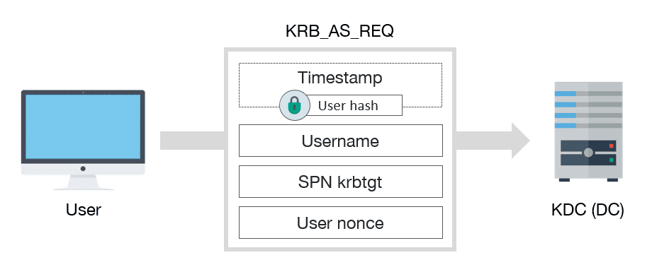
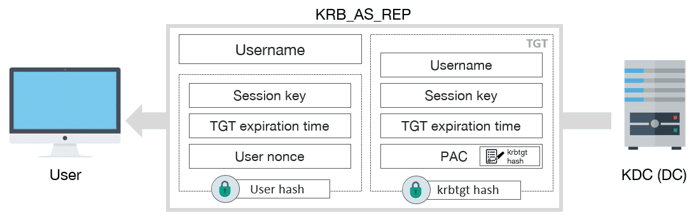
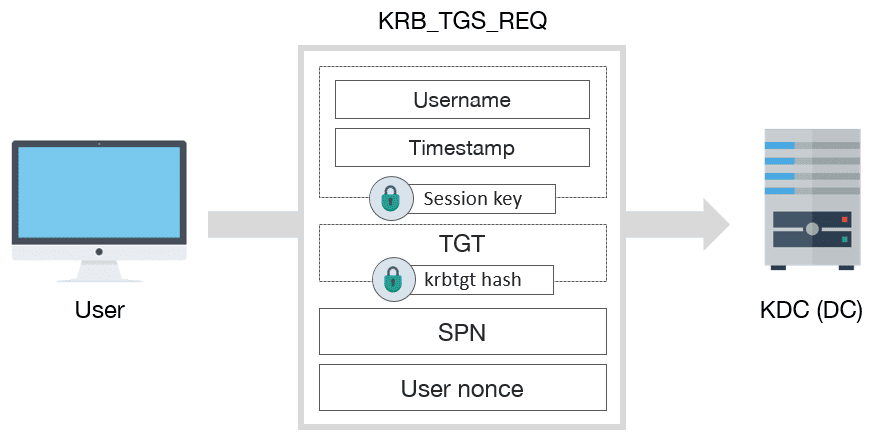
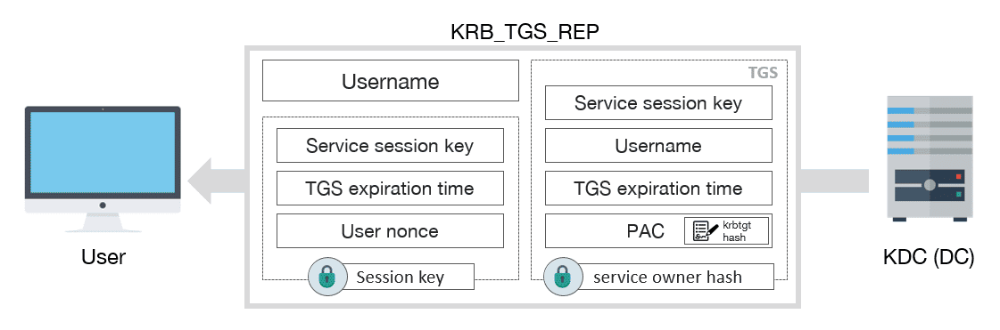

# Безопасность в сети: Введение

В современном мире цифровая безопасность — одна из самых актуальных проблем. В то время как интернет и локальные сети делают наши жизни удобнее, они также создают новые риски. С ростом количества пользователей и устройств, подключенных к сети, возрастает и количество атак, направленных на кражу личных данных, паролей и конфиденциальной информации.

Одной из ключевых задач в области безопасности является **защита данных при их передаче в сети**. Когда пользователь отправляет информацию — будь то логин и пароль, файлы или сообщения — данные могут быть перехвачены злоумышленниками, если не защищены должным образом. Рассмотрим основные угрозы, с которыми сталкиваются сети.

## Основные угрозы

### 1. Перехват данных (Man-in-the-Middle)
Это одна из самых распространённых атак, при которой злоумышленник может подслушивать или даже изменять данные, передаваемые между пользователем и сервером. Например, когда пользователь вводит пароль на веб-сайте через незащищённое соединение, этот пароль может быть захвачен и использован для несанкционированного доступа.

### 2. Фишинг
Фишинг — это способ получения конфиденциальной информации у пользователей через поддельные сайты или сообщения. Злоумышленники создают копии легитимных веб-ресурсов и заманивают пользователей вводить свои пароли, полагая, что они находятся на безопасном сайте.

### 3. Повторное использование паролей
Люди часто используют один и тот же пароль для разных сервисов. Это делает их уязвимыми, потому что при утечке одного пароля злоумышленники могут получить доступ к множеству ресурсов. Например, утечка пароля от социальной сети может привести к компрометации учетных записей в интернет-банкинге или почте.

### 4. Незащищенные протоколы
Многие старые протоколы передачи данных, такие как FTP и HTTP, не обеспечивают достаточной защиты, так как передают данные в незашифрованном виде. Это значит, что пароли, файлы и другая информация могут быть легко прочитаны злоумышленником, если он перехватит трафик.

### 5. Отсутствие шифрования при передаче данных
Без использования шифрования любой передаваемый трафик может быть подвергнут анализу. Например, если пользователь отправляет конфиденциальную информацию через общедоступные сети Wi-Fi, она может быть легко перехвачена, если не используется надлежащая защита.

## Основные методы защиты

Чтобы противостоять этим угрозам, были разработаны различные методы, обеспечивающие безопасность передачи данных в сетях:

### 1. Шифрование данных
Шифрование — это процесс преобразования данных в форму, которая недоступна для понимания без специальных ключей. Даже если злоумышленник перехватит зашифрованные данные, он не сможет их расшифровать без доступа к ключам. SSL/TLS — примеры технологий, которые обеспечивают шифрование данных в сети.

### 2. Безопасные протоколы (HTTPS, SSH, VPN)
Использование современных протоколов, таких как HTTPS, SSH и VPN, обеспечивает защищённую передачу данных через интернет. Эти протоколы включают механизмы шифрования и проверки подлинности, что делает атаки на данные значительно сложнее.

### 3. Многофакторная аутентификация (MFA)
Один из самых эффективных методов защиты — многофакторная аутентификация, при которой для подтверждения личности пользователя используется не только пароль, но и второй фактор — код, отправленный на телефон, или биометрические данные (например, отпечаток пальца).

### 4. Централизованная аутентификация
В больших организациях использование централизованных систем аутентификации, таких как **Kerberos**, позволяет улучшить как безопасность, так и удобство. Эти системы позволяют пользователям аутентифицироваться один раз и получать доступ к множеству сервисов, что минимизирует риски перехвата паролей.

# Введение в криптографию и типы шифров

Перед тем как углубиться в описание Kerberos, важно рассмотреть базовые концепции криптографии, поскольку она лежит в основе всех протоколов, обеспечивающих безопасность в сети.

## Типы шифров

Криптография, используемая для защиты информации, делится на два основных типа: симметричные и асимметричные шифры. Они различаются способом работы с ключами для шифрования и дешифрования данных.

### Симметричные шифры

Симметричные шифры предполагают использование одного и того же ключа для шифрования и дешифрования данных. Оба участника обмена информацией должны знать этот ключ заранее и использовать его для защиты данных.

Преимущества симметричных шифров:
- **Скорость:** Симметричные алгоритмы очень быстрые и эффективные. Это особенно важно, когда требуется обрабатывать большие объёмы данных за короткое время.
- **Низкие затраты ресурсов:** В сравнении с асимметричными шифрами, они потребляют меньше вычислительных ресурсов, что делает их привлекательными для часто повторяющихся операций.

Однако у симметричной криптографии есть и свои недостатки:
- **Безопасность ключа:** Основной проблемой является обмен ключом. Оба участника должны безопасно передать ключ друг другу, и если злоумышленник получит доступ к ключу, он сможет дешифровать всю информацию.

Примеры симметричных шифров:
- **AES (Advanced Encryption Standard):** Один из самых популярных и современных симметричных алгоритмов шифрования.
- **DES (Data Encryption Standard):** Ранее широко использовался, но теперь считается небезопасным.

### Асимметричные шифры

Асимметричные шифры работают с двумя ключами — публичным и приватным. Публичный ключ используется для шифрования информации и может быть доступен всем, в то время как приватный ключ используется для дешифрования и должен оставаться в секрете.

Преимущества асимметричных шифров:
- **Решение проблемы передачи ключа:** Поскольку публичный ключ можно свободно распространять, не возникает риска перехвата приватного ключа.
- **Использование в цифровых подписях:** Эти алгоритмы позволяют не только зашифровать данные, но и доказать их подлинность с помощью цифровых подписей.

Недостатки асимметричных шифров:
- **Медленная работа:** Асимметричные шифры медленнее, чем симметричные, особенно при обработке больших объёмов данных.
- **Большие ресурсы:** Такие алгоритмы требуют больше вычислительных ресурсов.

Примеры асимметричных шифров:
- **RSA (Rivest–Shamir–Adleman):** Один из самых популярных асимметричных алгоритмов, широко используемый для шифрования и цифровых подписей.
- **ECC (Elliptic Curve Cryptography):** Более новый алгоритм, обеспечивающий такую же безопасность, как и RSA, но с меньшими ключами и более высокой производительностью.

# Использование криптографии в протоколе Kerberos

Kerberos является протоколом аутентификации, который, как и большинство других протоколов безопасности, активно использует криптографию. Изначально он был разработан для использования **симметричной криптографии**, но с течением времени в него были добавлены расширения для поддержки **асимметричной криптографии**. Однако оба подхода имеют свои плюсы и минусы, которые мы рассмотрим далее.

## Симметричная и асимметричная криптография в Kerberos

Как было задумано изначально, Kerberos использует **симметричную криптографию** для аутентификации. Это означает, что и клиент, и сервер используют один и тот же секретный ключ для шифрования и дешифрования данных. Симметричные алгоритмы обеспечивают высокую производительность, что делает их популярным выбором для таких систем, как Kerberos.

Однако в некоторых случаях асимметричные методы, например, **PKI** (инфраструктура открытых ключей), могут быть полезны. Расширения, такие как **PKINIT**, позволяют использовать **асимметричную криптографию** для аутентификации с помощью смарт-карт или технологий вроде **Windows Hello**.

### Проблемы симметричной криптографии

Основной уязвимостью симметричной криптографии является человеческий фактор: **пользовательские пароли** могут быть слабыми или легко угадываемыми. В случае компрометации симметричного ключа, атакующий может получить доступ к системе. Переход на асимметричную криптографию не решает эту проблему полностью, поскольку возникает новая задача: как надёжно **хранить и защищать ключи**. На практике, обе эти задачи одинаково сложны.

### Проблемы с "золотыми" и "серебряными" билетами

Симметричные ключи не решают проблему **золотого билета**, когда злоумышленник может украсть секретный ключ krbtgt и использовать его для выдачи фальшивых билетов. Асимметричные ключи тоже не защищают от этой атаки, поскольку если атакующий может украсть симметричный ключ, он также сможет украсть и асимметричный.

Однако **серебряные билеты** выигрывают от использования асимметричной криптографии. В случае асимметричных схем сервисы не обязаны знать приватный ключ, что уменьшает вероятность утечки ключа.

### Взаимная аутентификация

Симметричные алгоритмы имеют важное преимущество — они обеспечивают **взаимную аутентификацию**, поскольку обе стороны знают один и тот же секретный ключ. В асимметричных схемах этого нет по умолчанию. Для достижения взаимной аутентификации в асимметричных системах приходится добавлять дополнительные ключи, что усложняет процесс обмена и защиту данных.

## Улучшение безопасности Kerberos

Вместо полного перехода на асимметричную криптографию, безопасность Kerberos можно значительно улучшить путём небольших изменений в текущей инфраструктуре:

- **Отказ от паролей**. Использование смарт-карт, Windows Hello, FIDO и других решений для отказа от слабых паролей.
- **Использование надёжных паролей для сервисных аккаунтов**. Генерация сложных паролей для служебных учётных записей (например, gMSA).
- **Отключение слабых шифров**. Исключение таких устаревших алгоритмов, как DES и RC4, из конфигураций безопасности.
- **Включение сложной аутентификации**. Внедрение механизмов compound authentication (armoring), что усиливает защиту аутентификационных данных.

Таким образом, симметричная криптография продолжает оставаться важным инструментом для защиты данных в Kerberos, а её правильное применение и укрепление существующих механизмов может обеспечить высокий уровень безопасности без необходимости перехода на полностью асимметричные протоколы.


# Введение в Kerberos

Аутентификация — это процесс подтверждения личности. Люди могут легко различать друг друга через различные физические характеристики и поведенческие особенности, но для компьютеров этот процесс требует использования формальных методов. В современном мире наиболее распространённым методом аутентификации для компьютеров являются пароли, которые представляют собой "разделённые секреты". Однако такой подход имеет два ключевых недостатка.


## Решение от Kerberos

Kerberos был разработан для решения этих проблем. Система позволяет пользователю запоминать один пароль, который обеспечивает доступ ко всей сети. Kerberos использует шифрование и механизмы обеспечения целостности сообщений, что защищает данные аутентификации при передаче по сети. Таким образом, Kerberos не только снижает количество паролей, которые пользователь должен помнить, но и предотвращает утечки конфиденциальной информации, решая проблему передачи паролей в незашифрованном виде.

# Определение Kerberos

Полное определение того, что предоставляет Kerberos, — это безопасная, единая аутентификация с доверием третьей стороны, основанная на взаимной аутентификации. 

## Безопасность
Kerberos безопасен, поскольку никогда не передаёт пароли по сети в открытом виде. Уникальность Kerberos заключается в его использовании билетов — временных криптографических сообщений, которые подтверждают личность пользователя на определённом сервере без передачи паролей по сети или кэширования паролей на локальном жёстком диске пользователя.

## Единая аутентификация
Единая аутентификация означает, что конечным пользователям нужно войти в систему только один раз для доступа ко всем сетевым ресурсам, которые поддерживают Kerberos. После того как пользователь аутентифицируется в Kerberos в начале своей сессии, его учётные данные автоматически передаются ко всем остальным ресурсам, к которым он обращается в течение дня.

## Доверенная третья сторона
Доверенная третья сторона относится к тому, что Kerberos работает через централизованный сервер аутентификации, которому все системы в сети по умолчанию доверяют. Все запросы на аутентификацию направляются через централизованный сервер Kerberos.

## Взаимная аутентификация
Взаимная аутентификация обеспечивает не только то, что человек за клавиатурой — это именно тот, за кого он себя выдаёт, но и подтверждает, что сервер, с которым он взаимодействует, — это именно тот, за кого он себя выдаёт. Взаимная аутентификация защищает конфиденциальность чувствительной информации, гарантируя, что служба, с которой общается пользователь, является подлинной.

Эти три концепции описывают основы службы сетевой аутентификации Kerberos. В следующей главе мы более подробно рассмотрим эти концепции и связанную с ними терминологию.

# История Kerberos

## Эволюция

Современный протокол Kerberos прошел через несколько значительных изменений с момента своего первоначального создания в рамках проекта Athena. Каждая новая версия приносила улучшения в удобстве использования, расширяемости и безопасности.

### Ранние версии Kerberos (v1, v2, v3)

Первые версии Kerberos (до версии 4) разрабатывались и использовались в MIT исключительно для тестирования. Эти реализации имели серьезные ограничения и служили лишь для исследования новых концепций и выявления практических проблем, возникающих в процессе разработки и тестирования.

### Kerberos 4

Первая версия Kerberos, которая была выпущена за пределы MIT, называется Kerberos 4. Она стала доступна для общественности 24 января 1989 года и была принята несколькими производителями, которые внедрили ее в свои операционные системы. Кроме того, крупные распределенные программные проекты, такие как Andrew File System, переняли идеи Kerberos 4 для своих собственных механизмов аутентификации.

Основы протокола Kerberos 4 были описаны в Техническом плане Athena, а детали протокола были зафиксированы в исходном коде эталонной реализации, опубликованной MIT.

Однако, из-за ограничений на экспорт шифровального программного обеспечения, установленных правительством США, Kerberos 4 не мог быть экспортирован за пределы страны. Поскольку Kerberos 4 использует шифрование DES, организации за пределами США не могли легально скачать это программное обеспечение в его первоначальном виде.

В ответ команда MIT убрала весь код шифрования из Kerberos 4, создав специализированную версию, которая могла быть экспортирована. Эррол Янг из Университета Бонда в Австралии адаптировал эту облегчённую версию Kerberos 4 и добавил свою собственную реализацию DES, получившую название "eBones". Поскольку eBones включал шифровальное программное обеспечение, разработанное вне США, он не подпадал под ограничения на экспорт и мог использоваться легально по всему миру.

На сегодняшний день несколько реализаций Kerberos 4 все еще существуют. Оригинальная реализация от MIT находится в режиме обслуживания и считается "мертвой". Распределение kth-krb, разработанное в Швеции, по-прежнему активно разрабатывается, но для новых установок рекомендуется использовать более современную версию Kerberos 5.

### Kerberos 5

Kerberos 5 был разработан для внедрения новых функций и повышения безопасности, отсутствовавших в версии 4 протокола. Это последняя версия протокола Kerberos, которая задокументирована в RFC 1510.

# Основные компоненты Kerberos

# Realms, Principals, and Instances в Kerberos

В Kerberos каждая сущность, будь то пользователь, компьютер или серверный сервис, имеет уникальный идентификатор — **принципал**. Этот принципал связан с долгосрочным ключом (например, паролем или ключевой фразой). Принципалы представляют собой глобально уникальные имена, организованные в иерархическую структуру.

## Структура принципалов

Принципал начинается с имени пользователя или сервиса, за которым может следовать необязательный **экземпляр** (*instance*). Экземпляры используются в двух случаях:

- для сервисных принципалов;
- для создания специальных принципалов с административными правами.

Например, администратор может иметь два принципала: 
- один для обычных задач;
- другой (с экземпляром `admin`) для операций с повышенными правами.

Имя пользователя и экземпляр формируют уникальную идентичность внутри одного реалма.  

**Реалм** (*realm*) — это административная область, задающая границы контроля в Kerberos.  

По соглашению, имя реалма основано на доменном имени DNS, преобразованном в верхний регистр. Например, для домена `example.org` реалм будет называться `EXAMPLE.ORG`. Однако это необязательно: реалм может называться иначе, например, `MYREALM.TEST`.

> **Важно:** Реалмы чувствительны к регистру. Например, `MYREALM.TEST` и `MyRealm.Test` — это разные реалмы.


## Пример принципала

Простой пример принципала пользователя:

jdoe@IT.EXAMPLE.ORG

- jdoe — имя пользователя.
- IT.EXAMPLE.ORG — имя реалма.

# Сервисные и хост-принципалы

Принципалы назначаются не только пользователям, но и хостам или сервисам, использующим Kerberos. В Kerberos оба конца соединения могут выполнять взаимную аутентификацию, поэтому каждому сервису и хосту необходим собственный принципал.


## Типы принципалов

- **Сервисные принципалы:**  
  Имя пользователя представляет название сервиса (например, `host` для хостов). Экземпляр указывает на имя хоста, где работает сервис. Такие сервисы называются "Kerberized".

- **Специальные принципалы:**  
  Система Kerberos также включает особые принципалы, например, `krbtgt` (ключевой для авторизации).


## Форматы принципалов в Kerberos 4 и 5

### Kerberos 4
Принципал состоит из:
- имени пользователя;
- экземпляра (если есть);
- реалма.

#### Пример:

jdoe.admin@IT.EXAMPLE.ORG

- jdoe — имя пользователя.
- admin — экземпляр (instance), указывающий на административные права.
- IT.EXAMPLE.ORG — имя реалма.

### Kerberos 5
Формат принципалов в Kerberos 5:

- component[/component][/component]...@REALM

#### Пример 1: Пользовательский принципал


 jdoe/admin@IT.EXAMPLE.ORG
- jdoe — имя пользователя.
- admin — экземпляр (instance), указывающий на административные права.
- IT.EXAMPLE.ORG — имя реалма.

#### Пример 2: Хост-принципал

host/unixsvr.example.org@IT.EXAMPLE.ORG
- host — имя сервиса.
- unixsvr.example.org — полное доменное имя хоста (FQDN).
- IT.EXAMPLE.ORG — имя реалма.

### Различия между Kerberos 4 и Kerberos 5
- В Kerberos 4 используется точка (.) для разделения имени пользователя и экземпляра, тогда как в Kerberos 5 используется слэш (/).
- В Kerberos 5 можно указывать FQDN, что позволяет использовать несколько машин с одинаковым именем хоста в одном реалме.

## 2. KDC (Key Distribution Center)

KDC, или Центр Распределения Ключей, является одним из ключевых компонентов системы Kerberos и выполняет две основные функции: аутентификация пользователей и распределение сеансовых ключей. KDC состоит из двух основных частей:

- **Аутентификационный сервер (AS)**: Этот компонент отвечает за проверку личности пользователей. Когда пользователь пытается получить доступ к сети, он отправляет запрос на аутентификацию в AS. После проверки его учетных данных (обычно это пароль) AS выдает пользователю Ticket Granting Ticket (TGT). TGT используется для получения дополнительных билетиков на доступ к сервисам.

- **Сервер выдачи билетиков (TGS)**: TGS отвечает за выдачу билетиков на доступ к конкретным сервисам в сети. Когда пользователь хочет подключиться к какому-либо сервису, он использует TGT, чтобы запросить билет для этого сервиса. TGS проверяет действительность TGT и, если все в порядке, выдает билет на доступ к запрашиваемому сервису.

KDC хранит базу данных учетных записей пользователей и сервисов, а также связанные с ними ключи шифрования. Централизованное управление аутентификацией упрощает администрирование и повышает безопасность, так как ключи хранятся в одном месте и защищены от несанкционированного доступа.

## Билеты в Kerberos

Kerberos вводит концепцию **билетов**. Концептуально, билет Kerberos — это зашифрованная структура данных, выданная **Центром распределения ключей (KDC)**, которая включает общий ключ шифрования, уникальный для каждой сессии, и флаги билета, которые указывают на некоторые атрибуты, такие как возможность передавать билет другому сервису, а также другие поля.

Билеты выполняют две основные функции:
1. Подтверждение личности конечных участников.
2. Установление короткоживущего ключа шифрования (так называемый **сессионный ключ**), который обе стороны могут использовать для безопасной связи.

## Понимание билетов

Лучше всего думать о билетах как о **лицензии**, выданной KDC для подтверждения вашей личности. Подобно лицензии в реальной жизни, каждый билет включает:
- Данные о пользователе или сервисе.
- Период действия билета.
- Ограничения на его использование.

Основные поля, которые Kerberos включает в каждый билет:
- **Имя запрашивающего принципала** (принципал пользователя).
- **Имя принципала сервиса**.
- **Период действия**: Когда билет становится действительным и когда он истекает.
- **Список IP-адресов**, с которых может быть использован билет.
- **Сессионный ключ**: Общий секретный ключ шифрования, используемый для связи между пользователем и приложением.

Некоторые поля заполняются KDC:
- KDC накладывает **максимальное время жизни билета**.
- KDC генерирует **уникальный сессионный ключ** для каждого билета.

Другие поля заполняются клиентом и передаются KDC при запросе билета.

Когда билет генерируется KDC, он зашифрован, чтобы предотвратить возможность его модификации злоумышленниками. Это гарантирует, что нельзя изменить срок действия билета или имя принципала.

## Время жизни билета

Билеты имеют **краткосрочное действие**, обычно от 10 до 24 часов. Это относительно короткое время жизни сбалансировано между удобством **единого входа (SSO)** и угрозой безопасности, связанной с кражей учетных данных и их использованием в течение длительного времени. Ограничивая срок действия билетов Kerberos, ущерб от украденного билета минимизируется, при этом пользователь продолжает пользоваться удобством единого входа в течение рабочего дня.

## Кэш билетов (или учетных данных)

Когда мы работаем с билетами в Kerberos, возникает вопрос: **где они хранятся?** Ответ зависит от реализации. 

### Типы кэша билетов

### 1. **Файловый кэш учетных данных**  
Первоначальная реализация Kerberos от MIT использует файловый подход. Когда вы входите в систему Kerberos и получаете билеты для "Kerberized" сервисов, они хранятся в файле.  
Этот метод был выбран из-за своей переносимости: каждая платформа имеет файловую систему, и работать с файлами легко.  
**Недостатки:**
- Негибкость.
- Низкая безопасность.

### 2. **Кэш в памяти**
Реализации Kerberos от Microsoft и Apple используют **память для хранения билетов**:
- Учетные данные сохраняются в оперативной памяти.
- Они уничтожаются при завершении сессии входа в систему, что делает этот подход более безопасным.

## Содержимое кэша билетов
Независимо от способа хранения, кэш билетов содержит:
- **Принципал пользователя**.
- **Набор билетов сервисов**, полученных в течение сессии.

Пример файлового кэша можно увидеть ниже:

	$ klist
	Ticket cache: FILE:/tmp/krb5cc_502_auJKaJ
	Default principal: jgarman@WEDGIE.ORG

	Valid starting     Expires            Service principal
	09/10/02 01:48:12  09/10/02 11:48:12 krbtgt/WEDGIE.ORG@WEDGIE.ORG
	09/10/02 01:48:14  09/10/02 11:48:12 host/cfs.wedgie.org@WEDGIE.ORG
	09/10/02 04:20:42  09/10/02 11:48:12 host/web.wedgie.org@WEDGIE.ORG

# Протокол Нидхема-Шрёдера: История и Принципы Работы

## История

Протокол Нидхема-Шрёдера был предложен в 1978 году учеными Роджером Нидхемом и Майклом Шрёдером в качестве метода аутентификации между двумя сторонами в небезопасной сети. Целью разработки было обеспечение уверенности в том, что обе стороны действительно те, за кого себя выдают, даже если сеть подвержена атакам, таким как перехват данных.

Этот протокол стал основой для множества современных методов аутентификации, включая Kerberos, который адаптировал базовые идеи Нидхема-Шрёдера и усилил их для использования в сложных вычислительных системах.


## Как работает протокол Нидхема-Шрёдера

Протокол Нидхема-Шрёдера использует центральный доверенный узел, известный как **Сервер аутентификации** (Authentication Server), для обмена ключами между сторонами.

Основные участники:
- **Клиент (A)** — инициатор соединения.
- **Сервер (B)** — участник, с которым клиент хочет установить безопасное соединение.
- **Центральный сервер (S)** — доверенный посредник, обеспечивающий распределение ключей.

### Этапы работы

1. **Запрос клиента:**
   - Клиент A отправляет на сервер S запрос, указывая свою идентичность и идентичность B, с которым он хочет общаться.

   ```
   A -> S: A, B, N1
   ```
   Здесь N1 — случайное число (nonce), используемое для защиты от повторных атак.

2. **Ответ сервера:**
   - Сервер S генерирует временный симметричный ключ (K_AB), который будет использоваться A и B для общения.
   - Сервер шифрует этот ключ дважды: один раз для A, другой раз для B.

   ```
   S -> A: {K_AB, B, N1}K_A, {K_AB, A}K_B
   ```
   Здесь:
   - `{...}K_A` — данные, зашифрованные ключом клиента A.
   - `{...}K_B` — данные, зашифрованные ключом клиента B.

3. **Передача ключа серверу B:**
   - A отправляет зашифрованное сообщение, предназначенное для B, включая его часть ключа K_AB.

   ```
   A -> B: {K_AB, A}K_B
   ```

4. **Подтверждение связи:**
   - B отправляет клиенту A случайное число N2, зашифрованное с помощью K_AB.

   ```
   B -> A: {N2}K_AB
   ```

5. **Проверка подлинности:**
   - A расшифровывает сообщение, модифицирует N2 и отправляет обратно.

   ```
   A -> B: {N2-1}K_AB
   ```

Если B получает корректное значение N2-1, связь установлена, и обе стороны могут доверять друг другу.


## Ограничения протокола

Хотя протокол Нидхема-Шрёдера был революционным для своего времени, он имеет некоторые недостатки:

1. **Уязвимость к атакам повторного воспроизведения:** Если злоумышленник перехватит сообщения, он может повторно использовать их для обмана одной из сторон.
2. **Полагание на центральный сервер:** Если сервер скомпрометирован, вся сеть оказывается уязвимой.


## Значение для Kerberos

Kerberos адаптирует протокол Нидхема-Шрёдера, усиливая его с помощью временных меток, которые защищают от повторных атак, а также улучшая управление ключами и безопасность аутентификации. Эти усовершенствования делают Kerberos более устойчивым к современным угрозам и подходящим для сложных сетевых систем.


# Процесс аутентификации в Kerberos

Ниже показана сводная информация о последовательности сообщений для выполнения аутентификации:


Чтобы начать работу с Kerberos, клиенту необходимо получить первоначальный билет (Ticket-Granting Ticket, TGT) от KDC. Этот билет используется как основа для дальнейшей аутентификации и доступа к сервисам в рамках доверенной инфраструктуры Kerberos.

Процесс начинается с формирования клиентом специального сообщения KRB_AS_REQ, которое отправляется на сервер KDC. Это сообщение содержит параметры запроса и служит первым шагом в процессе аутентификации.


# Описание содержимого KRB_AS_REQ:

### User (Клиент)
Клиент, представляющий пользователя или устройство, которое хочет аутентифицироваться в системе Kerberos.


### KRB_AS_REQ
Сообщение запроса аутентификационной службы (**Authentication Service Request**), которое отправляется клиентом на KDC.


### Поля KRB_AS_REQ:

- **Timestamp (Метка времени)**
  - Служит для предотвращения атак воспроизведения (**replay attacks**). Показывает текущее время отправки запроса.
  - Подписана хэшем, основанным на пароле пользователя (**User hash**), который KDC сможет проверить.

- **Username (Имя пользователя)**
  - Имя пользователя или учетная запись, которая инициирует запрос. Это позволяет KDC идентифицировать отправителя.

- **SPN krbtgt (Имя службы для TGT)**
  - Указывает на службу `krbtgt` (**Kerberos Ticket Granting Ticket**). Это означает, что пользователь запрашивает TGT, который будет использоваться для доступа к другим сервисам.

- **User nonce (Случайное число)**
  - Случайно сгенерированное число, уникальное для этого запроса. Оно обеспечивает уникальность сообщения и защищает от повторной отправки.


### KDC (DC)
Центр распределения ключей (**KDC**), который включает в себя службу аутентификации.

#### После получения сообщения KRB_AS_REQ, KDC:
- Проверяет подпись и хэш, чтобы удостовериться в подлинности запроса.
- Генерирует билет **TGT** (**Ticket Granting Ticket**), который клиент сможет использовать для дальнейшего взаимодействия с другими сервисами.


## Описание сообщения KRB_AS_REQ

Клиент может указать ряд опций в начальном запросе. Среди этих опций:

- Выполнение предварительной аутентификации (pre-authentication).
- Запрос билета с возможностью продления (renewable).
- Возможность делегирования (proxiable) или переноса (forwardable) билета.
- Постдатировка билета или разрешение на постдатировку производных билетов.
- Возможность принятия возобновляемого билета вместо невозобновляемого, если срок действия запрашиваемого билета не может быть удовлетворен из-за конфигурационных ограничений.

Клиент формирует сообщение **KRB_AS_REQ** и отправляет его в KDC.


## Обработка сообщения KRB_AS_REQ

Если запрос успешно обработан, результатом станет создание билета для клиента, который будет использоваться для доступа к серверу. Формат билета описан в [Разделе 5.3 RFC 4120](https://datatracker.ietf.org/doc/html/rfc4120#section-5.3).

### Надежность передачи

Так как Kerberos может использовать ненадежные транспорты, такие как UDP, KDC **обязан** быть готовым повторно передать ответы, если они будут потеряны. 

- Если KDC получает идентичный запрос, который ранее был успешно обработан, он **должен** ответить сообщением **KRB_AS_REP**, а не ошибкой повторного воспроизведения.
- Чтобы уменьшить объем данных шифрованного текста, доступного потенциальным злоумышленникам, KDC **может** отправить тот же самый ответ, который был сгенерирован при первичной обработке запроса.
- KDC **должен** соблюдать это поведение повторного ответа, даже если используется надежный транспорт.

# Формирование сообщения KRB_AS_REP
##  Описание схемы



На схеме изображён процесс формирования сообщения KRB_AS_REP в протоколе Kerberos.

1. **User** (Пользователь) — отправляет запрос на аутентификацию (KRB_AS_REQ) к серверу аутентификации (KDC).
2. **KDC (DC)** — сервер аутентификации, который проверяет пользователя и выдаёт сообщение KRB_AS_REP.
3. **KRB_AS_REP** — ответ на запрос пользователя. Содержит:
   - Имя пользователя (Username);
   - Сессионный ключ (Session key);
   - Время истечения действия TGT (TGT expiration time);
   - Nonce пользователя (User nonce);
   - PAC (Privilege Attribute Certificate).

Данные в KRB_AS_REP шифруются:
- Хэшем пароля пользователя (User hash) — для зашифровки данных, которые пользователь сможет расшифровать своим паролем.
- Хэшем ключа krbtgt (krbtgt hash) — для зашифровки TGT.

## Формирование KRB_AS_REP (из RFC 4120)

### Обработка запроса
1. **Проверка пользователя:**
   - Если указанный клиент не существует в базе данных KDC, возвращается ошибка `KDC_ERR_C_PRINCIPAL_UNKNOWN`.
   - Если требуется преаутентификация и она не проходит, возвращается ошибка `KDC_ERR_PREAUTH_FAILED`.

2. **Преаутентификация:**
   - Если преаутентификация необходима, но отсутствует в запросе, возвращается ошибка `KDC_ERR_PREAUTH_REQUIRED` с информацией о доступных механизмах.
   - Пример доступных методов: `PA-ETYPE-INFO`, `PA-ETYPE-INFO2`.

3. **Генерация сессионного ключа:**
   - Сессионный ключ генерируется случайным образом.
   - Рекомендуется использовать генераторы случайных чисел на основе физических явлений (см. [RFC4086]).

4. **Выбор метода шифрования:**
   - Из списка `etype`, указанного в запросе, выбирается первый доступный метод.
   - Сессионный ключ шифруется ключом пользователя, сформированным с использованием функции string-to-key (см. [RFC3961]).

### Настройка времени действия TGT
- **Время начала действия:**
   - Если `starttime` отсутствует или указывает время в прошлом, используется текущее время KDC.
   - Если указано время в будущем за пределами допустимого интервала, возвращается ошибка `KDC_ERR_CANNOT_POSTDATE`.
- **Время окончания действия:**
   - Определяется как минимальное из:
     - Времени окончания, указанного в запросе.
     - Максимального времени действия, заданного политиками KDC.
- **Флаг RENEWABLE:**
   - Если запрошен, устанавливается флаг `RENEWABLE`, и задаётся максимальное время продления.

### Формирование ответа
1. **Шифрование TGT:**
   - TGT шифруется с использованием ключа сервиса `krbtgt`.

2. **Формирование KRB_AS_REP:**
   - Включаются адреса клиента, данные преаутентификации и другие параметры.
   - Ответ шифруется с использованием ключа пользователя.

## Получение и проверка KRB_AS_REP (клиентом)
1. **Проверка содержимого:**
   - Поля `cname` и `crealm` должны соответствовать запросу.
   - Nonce в ответе должен совпадать с Nonce, отправленным в запросе.

2. **Дешифровка:**
   - Клиент дешифрует ответ своим ключом.
   - Проверяются поля `sname`, `srealm` и адреса.

3. **Сохранение данных:**
   - Сохраняются билет, сессионный ключ, время действия и другая информация для последующего использования.

## Примечания
- Для обеспечения безопасности сессионный ключ должен быть невозможно предсказать.
- Настройки времени должны учитывать политики локального домена.
- Корректная дешифровка KRB_AS_REP не гарантирует проверку личности пользователя; для этого могут потребоваться дополнительные механизмы (например, проверка учётных данных приложений).

# KRB_TGS_REQ — Обмен с сервером Ticket-Granting Server (TGS)
## Описание схемы запроса



На изображении показан процесс отправки запроса KRB_TGS_REQ от пользователя (клиента) к серверу Kerberos Ticket-Granting Server (KDC). Запрос включает в себя следующие компоненты:

- **Username** — Имя пользователя, который инициирует запрос.
- **Timestamp** — Момент времени, чтобы предотвратить повторный запуск запроса.
- **Session key** — Сессионный ключ, зашифрованный ранее выданным TGT.
- **TGT (Ticket-Granting Ticket)** — Ранее выданный билет, удостоверяющий пользователя.
- **SPN (Service Principal Name)** — Имя запрашиваемого сервиса.
- **User nonce** — Случайное значение для предотвращения атак воспроизведения.

После подготовки этот запрос отправляется на сервер KDC (или DC — Domain Controller в среде Windows), который обрабатывает его и возвращает ответ.


## Полезная информация из RFC 4120

### Общая концепция TGS Exchange
Обмен с сервером TGS инициируется клиентом, когда требуется получить аутентификационные данные для сервиса. Это может быть:
- Запрос на доступ к сервису.
- Обновление существующего билета (renewal).
- Валидация билета.
- Получение прокси-билета.

Клиент уже должен иметь Ticket-Granting Ticket (TGT), полученный в результате AS (Authentication Service) обмена. Обычно TGT выдается при первичной аутентификации, например, при входе в систему.

### Основные характеристики KRB_TGS_REQ
- **Шифрование и дешифрование**: В отличие от AS обмена, в TGS обмене используется сессионный ключ из TGT или дополнительный субсессионный ключ, если он предоставлен.
- **Истечение срока действия**: TGS не принимает просроченные билеты. Если TGT истек, клиенту нужно запросить новый.

### Формат обмена
Обмен состоит из двух сообщений:
1. **KRB_TGS_REQ** — Запрос от клиента к серверу TGS.
2. **KRB_TGS_REP** или **KRB_ERROR** — Ответ сервера TGS. В случае успеха возвращается KRB_TGS_REP с необходимыми учетными данными. В случае ошибки возвращается KRB_ERROR с кодом ошибки и текстовым описанием.

### Структура KRB_TGS_REQ
Запрос включает:
- Аутентификационную информацию (KRB_AP_REQ), содержащую TGT.
- Список сетевых адресов (опционально).
- Авторизационные данные для передачи в сервис (опционально).
- Дополнительные билеты, если это необходимо.

### Генерация KRB_TGS_REQ
1. Клиент определяет, в каком домене (realm) зарегистрирован запрашиваемый сервис.
2. Если у клиента нет TGT для указанного домена, он запрашивает его рекурсивно через KRB_TGS_REQ.
3. После получения нужного TGT клиент готовит запрос, включающий:
   - Аутентификационный заголовок (padata).
   - Основные поля (например, SPN, timestamp и т.д.).
   - Опциональные поля, такие как enc-authorization-data.
4. Запрос отправляется серверу TGS для обработки.

### Обработка KRB_TGS_REQ
1. Сервер TGS определяет, для какого сервиса предназначен билет (TGT).
2. Проводится проверка подлинности клиента с помощью предоставленного TGT.
3. Если все проверки успешны, сервер возвращает KRB_TGS_REP с запрошенными данными, зашифрованными сессионным ключом из TGT.


## Важные моменты
- Клиент должен использовать только доверенные источники для определения пути аутентификации (например, иерархия доменов).
- Сервер TGS обеспечивает защиту от повторных атак (replay attacks) с помощью nonce и временных меток.
- Ответы сервера могут включать коды ошибок для диагностики проблем, таких как истечение срока действия билета или некорректная аутентификация.

# KRB_TGS_REP — Обмен с сервером Ticket-Granting Server (TGS)

## Описание схемы запроса

На схеме показано взаимодействие между тремя основными компонентами:
* User (Клиент) - запрашивающая сторона
* KDC (DC) - Key Distribution Center/Domain Controller
* TGS - Ticket Granting Service

## Структура сообщения KRB_TGS_REP

### Клиентская часть (левая сторона схемы):
* Username - идентификатор пользователя
* Service session key - ключ сессии для сервиса
* TGS expiration time - время истечения билета
* User nonce - случайное число для проверки свежести ответа
* Session key - ключ сессии, зашифрованный для клиента

### Серверная часть TGS (правая сторона схемы):
* Service session key - ключ сессии для сервиса
* Username - идентификатор пользователя
* TGS expiration time - время истечения билета
* PAC (Privilege Attribute Certificate) - атрибуты привилегий
* Service owner hash - хеш владельца сервиса для шифрования

## Процесс обработки и генерации ответа

### Генерация KRB_TGS_REP:
1. Формат сообщения совпадает с KRB_AS_REP, но имеет специфический тип KRB_TGS_REP
2. Из TGT копируются следующие поля:
   * Адресное поле
   * Имя и область клиента
   * Список пройденных областей
   * Время начальной аутентификации
   * Время истечения
   * Данные авторизации

### Шифрование и безопасность:
1. Зашифрованная часть ответа использует:
   * Подсессионный ключ из Authenticator (если указан)
   * Сессионный ключ из TGT
2. Важно: не используется секретный ключ клиента
3. Проверка отозванных билетов по "горячему списку"

### Временные параметры:
1. Время начала:
   * При отсутствии - используется текущее время сервера
   * При указании будущего времени - требуется флаг POSTDATE
2. Время окончания - минимальное из:
   * Запрошенного времени
   * Времени окончания TGT
   * Времени начала TGT плюс максимальный период жизни

### Процесс валидации:
1. Проверка целостности данных
2. Валидация всех необходимых флагов
3. Проверка временных меток
4. Верификация данных авторизации

## Получение и обработка клиентом

1. KRB_TGS_REP обрабатывается аналогично KRB_AS_REP
2. Расшифровка выполняется с использованием:
   * Подсессионного ключа из Authenticator
   * Сессионного ключа из TGT
3. Проверка соответствия имени сервера истинному principal name

Данный механизм обеспечивает безопасную аутентификацию и авторизацию в распределенных системах, являясь основой протокола Kerberos V5.

# KRB_AP_REQ: Описание сообщения

## Описание схемы запроса
На диаграмме показан процесс передачи сообщения KRB_AP_REQ между клиентом (пользователем) и сервером приложений (Application Server, обозначенный как AP). Основные элементы сообщения:

1. **TGS (Ticket Granting Service)**:
   - Хэш владельца сервиса (Service owner hash).
   - Имя пользователя (Username).
   - Метка времени (Timestamp).
   - Ключ сессии сервиса (Service session key).

2. **Процесс**:
   - Клиент отправляет сообщение KRB_AP_REQ серверу приложений (AP) для установления аутентифицированного соединения.

## Полезная информация из RFC 4120

### Что такое KRB_AP_REQ
Сообщение KRB_AP_REQ содержит данные для аутентификации и должно быть частью первого сообщения в аутентифицированной транзакции. Оно включает:
- **Тикет (Ticket)**: предоставляет права доступа, но сам по себе недостаточен для аутентификации, так как передается в открытом виде.
- **Аутентификатор (Authenticator)**: предотвращает повторное использование тикетов (replay-атаки), доказывая, что клиент знает сессионный ключ тикета.
- Дополнительные данные (описаны в разделе 5.5.1).

Сообщение KRB_AP_REQ также называется "заголовком аутентификации" (authentication header).

### Генерация KRB_AP_REQ
Когда клиент хочет инициировать аутентификацию, он:
1. Получает тикет и сессионный ключ (через кеш учётных данных, обмен AS или TGS).
2. Создает новый аутентификатор, который включает:
   - Текущее системное время.
   - Имя клиента.
   - Опционально: контрольную сумму приложения, начальный номер последовательности, сессионный под-ключ.

> **Важно:** Аутентификаторы нельзя использовать повторно. Сервер должен отклонять их при повторной отправке.

3. Аутентификатор шифруется сессионным ключом и объединяется с тикетом для формирования сообщения KRB_AP_REQ, которое отправляется на сервер.

### Обработка KRB_AP_REQ на сервере
Сервер аутентифицирует клиента на основе следующих данных:
- Текущее время сервера.
- Аутентификатор.
- Тикет.

#### Возможные ошибки:
1. **KRB_AP_ERR_MSG_TYPE**: Неверный тип сообщения.
2. **KRB_AP_ERR_BADKEYVER**: Версия ключа, указанная в тикете, недоступна серверу.
3. **KRB_AP_ERR_NOKEY**: У сервера нет ключа для расшифровки тикета.
4. **KRB_AP_ERR_BAD_INTEGRITY**: Тикет или аутентификатор изменены.
5. **KRB_AP_ERR_BADMATCH**: Имя клиента или домен не совпадают.
6. **KRB_AP_ERR_BADADDR**: Адрес клиента не совпадает с адресом в тикете.
7. **KRB_AP_ERR_SKEW**: Разница во времени между клиентом и сервером превышает допустимое значение.
8. **KRB_AP_ERR_REPEAT**: Аутентификатор уже использовался.
9. **KRB_AP_ERR_TKT_NYV**: Тикет ещё недействителен (not yet valid).
10. **KRB_AP_ERR_TKT_EXPIRED**: Тикет истёк.

Если все проверки проходят успешно, сервер подтверждает аутентификацию клиента. Однако, факт аутентификации не гарантирует авторизацию. Для авторизации требуется дополнительная проверка на основе локальных правил доступа или внешних сервисов.

### Примечания по реализации
- Сервер должен использовать кеш для защиты от повторного использования аутентификаторов (replay cache).
- При потере данных о недавно обработанных аутентификаторах сервер должен отклонять все запросы до истечения допустимого временного интервала (clock skew).
- При наличии нескольких сервисов с одним принципалом (principal) необходимо использовать общий кеш или встроенную защиту от повторного использования.

# Проверка PAC и механизм PAC Verify Response в Kerberos

## Что такое PAC?

**PAC** (Privilege Attribute Certificate) — это структурированный контейнер, который используется в Kerberos для передачи авторизационных данных. Он содержит такие данные, как:

- Список групп безопасности пользователя.
- Привилегии учетной записи.
- Политики, связанные с учётной записью.

PAC важен в средах Windows и используется для интеграции Kerberos с Active Directory.

## krb_verify_pac: Процесс проверки PAC

`krb_verify_pac` — это функция, которая проверяет подлинность и целостность данных PAC. Она предотвращает такие атаки, как подделка или изменение PAC. 

### Этапы проверки PAC:

1. **Проверка подписи PAC:**
   - PAC содержит две цифровые подписи:
     - **Server Signature**: Подписана ключом сервиса, который использует PAC.
     - **KDC Signature**: Подписана KDC для защиты содержимого PAC.
   - `krb_verify_pac` проверяет обе подписи:
     - Убедиться, что PAC был создан подлинным KDC.
     - Убедиться, что PAC не изменялся после его создания.

2. **Сравнение ключей:**
   - Для проверки используются ключи сервиса и KDC. Если подписи не совпадают, процесс аутентификации останавливается.

3. **Проверка синхронизации:**
   - Данные PAC проверяются на соответствие учётной записи пользователя (например, в Active Directory).

4. **Взаимодействие с KDC (при необходимости):**
   - Если сервер не может выполнить проверку локально, он может отправить запрос в KDC для подтверждения подлинности PAC.


## PAC Verify Response: Ответ KDC

PAC Verify Response — это ответ от KDC, который подтверждает или опровергает подлинность PAC. Этот процесс используется, когда сервер не доверяет локальной проверке PAC.

### Этапы работы PAC Verify Response:

1. **Запрос сервера к KDC:**
   - Сервер отправляет PAC и дополнительные данные сессии (например, идентификаторы пользователя) в KDC для проверки.
   - Запрос служит для подтверждения того, что PAC был выдан доверенным KDC и не был изменён.

2. **Проверка на стороне KDC:**
   - KDC повторно проверяет подписи PAC (Server Signature и KDC Signature).
   - Сравнивает содержимое PAC с данными, записанными при его создании.

3. **Ответ от KDC:**
   - **Положительный ответ:** KDC подтверждает подлинность PAC.
   - **Отрицательный ответ:** KDC сообщает об ошибке, если:
     - Подписи не совпадают.
     - Время действия PAC истекло.
     - Содержимое PAC не совпадает с учётной записью пользователя.

4. **Действия сервера:**
   - Если KDC подтверждает PAC, сервер продолжает обработку запроса.
   - Если PAC недействителен, сервер завершает процесс аутентификации с ошибкой.


## Ошибки при проверке PAC

1. **Неверная подпись (KDC или Server Signature):**
   - PAC мог быть подделан, либо использованы некорректные ключи.
   - Аутентификация отклоняется.

2. **Истёкший PAC:**
   - PAC содержит временные ограничения, по истечении которых он становится недействительным.

3. **Несоответствие учётной записи:**
   - Если данные PAC больше не соответствуют учётной записи (например, пользователь был удалён из группы), то проверка проваливается.


## Роль PAC в Kerberos

PAC обеспечивает эффективную передачу авторизационных данных, избегая дополнительных запросов к KDC или базе данных. Это позволяет Kerberos интегрироваться с Active Directory и предоставлять данные о привилегиях пользователя напрямую сервисам.

# KRB_AP_REP

## 1. Генерация сообщения KRB_AP_REP

- **Когда требуется KRB_AP_REP?**  
  Если требуется взаимная аутентификация (клиент аутентифицирует сервер), то поле `MUTUAL-REQUIRED` в `ap-options` сообщения `KRB_AP_REQ` будет установлено. В этом случае сервер обязан отправить сообщение `KRB_AP_REP`.

- **Структура и поля:**
  - **Метка времени (timestamp) и микросекунды (microseconds):**
    - Должны быть взяты из аутентификатора клиента (`Authenticator`), отправленного в `KRB_AP_REQ`.
  - **Номер последовательности (sequence number):**
    - Если включается, он должен быть случайно сгенерирован.
  - **Subkey (опционально):**
    - Может быть добавлен, если сервер хочет предложить новый подчинённый ключ.
  - Сообщение зашифровывается с использованием сеансового ключа, извлечённого из тикета.

- **Различие между версиями протокола:**
  - В Kerberos V4 метка времени в ответе была на единицу больше, чем метка времени клиента.
  - В Kerberos V5 это больше не требуется из-за улучшенного формата сообщений.


## 2. Обработка KRB_AP_REP клиентом

- **Действия клиента:**
  1. Расшифровывает сообщение с использованием сеансового ключа.
  2. Проверяет, совпадают ли метка времени и микросекунды с отправленными в `Authenticator`.
  3. Если проверка успешна, клиент убеждается в подлинности сервера.
  4. Сохраняет номер последовательности и подчинённый ключ (если они присутствуют) для дальнейшего использования.

- **Особенности:**
  - Для шифрования сообщения KRB_AP_REP не используется подчинённый ключ из аутентификатора, даже если он присутствует.


## 3. Использование сеансового ключа

- **После обмена KRB_AP_REQ/KRB_AP_REP:**
  - Клиент и сервер разделяют общий сеансовый ключ.
  - Этот ключ может использоваться для:
    - Сообщений KRB_PRIV (для конфиденциальности).
    - Сообщений KRB_SAFE (для проверки целостности).
    - Других приложений, требующих защиты данных.

- **Генерация новых ключей:**
  - Приложение может использовать подчинённые ключи (subkeys) для создания ключей для последующего взаимодействия.
  - Сервер может вернуть новый подчинённый ключ в ответе KRB_AP_REP.

- **Рекомендации по безопасности:**
  - Для уменьшения рисков, связанных с ошибками генерации случайных чисел, приложения должны включать всю энтропию из сеансового ключа, созданного KDC.


## 4. Пример использования ключей

- Клиент может предложить подчинённый ключ в поле `subkey` аутентификатора.
- Сервер выбирает новый ключ, основываясь на предложении клиента, и возвращает его в поле `subkey` ответа.
- Новый ключ используется для дальнейшей защиты данных.


## 5. Учет конфиденциальности и целостности

- **Рекомендации для приложений:**
  - Не передавайте конфиденциальную информацию без взаимной аутентификации.
  - Используйте сообщения:
    - **KRB_PRIV** для обеспечения конфиденциальности.
    - **KRB_SAFE** для обеспечения целостности.

- **Роль KRB_AP_REP:**
  - Это сообщение обеспечивает клиента и сервер в идентичности друг друга.
  - Дальнейшее использование ключей зависит от потребностей приложения.

